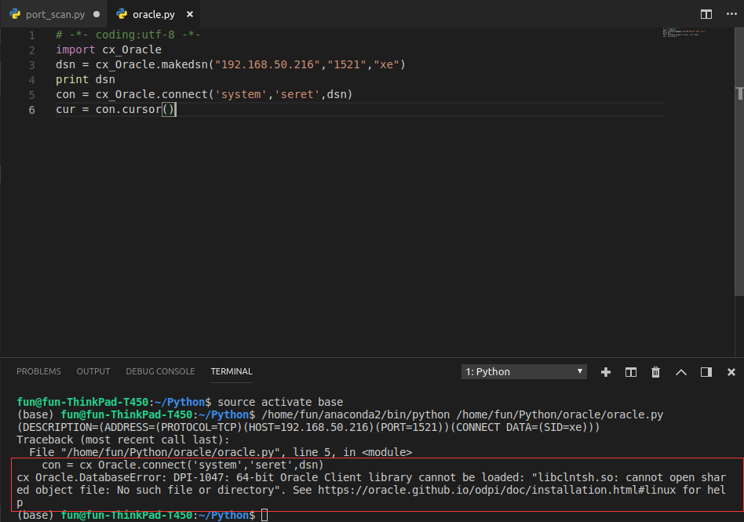
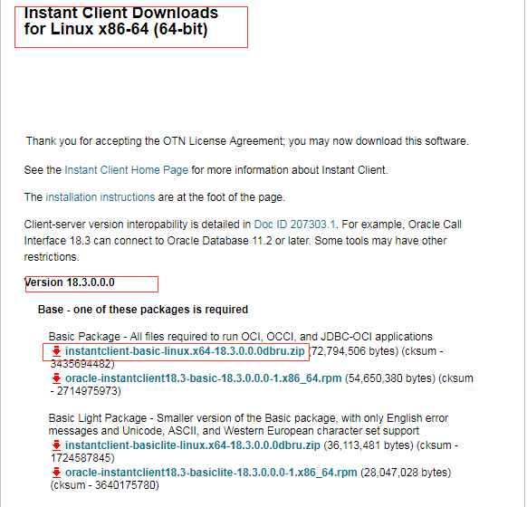
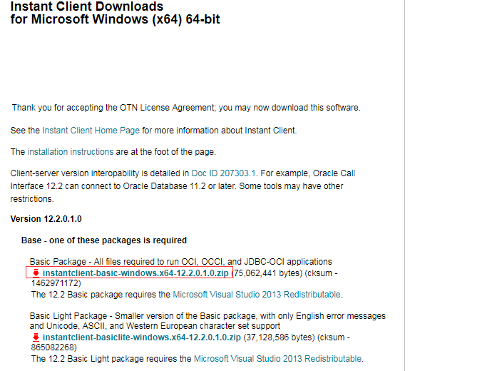
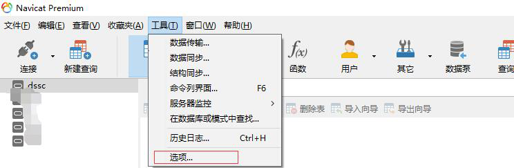

# Oracle部署

## **第一部：准备工作**

一、**环境准备**

①　操作系统：Ubuntu 14.04

②　Docker 版本只适合Ubuntu 14.04

 

二、**安装包准备**

①　安装包名：oracle_install.tar.gz

 

## **第二部：Oracle安装**

一、**解压安装包**

①　tar  -zxvf  oracle_install.tar.gz

二、**执行安装包**

①　cd  oracle 

②　bash  oracle_install.sh

 

## **第三部：服务参数介绍**

一、**ssh远程服务**

①　用户名：root

②　密码：secret

③　端口：49160

④　ssh  root@ip  -p  49160

 

二、**Oracle数据库**

①　Hostname: localhost

②　sid : xe

③　端口：1521

④　username: system

⑤　password: secret

 

 

 

 

三、**Tomcat管理**

①　Url: [http://localhost:8081/manager](http://localhost:8080/manager)

②　User : ADMIN

③　Password : secret

四、**Oracle Application Express web management**

①　Url: [http://localhost:8081/ords/apex](http://localhost:8080/ords/apex)

②　Worksqpce :INTERNAL

③　User : ADMIN

④　Password: secret

## **第四部：连接数据库**

一、**配置linux客户端**

①　下载cx_Oracle模块

②　连接数据库（你会发现正常是无法连接的，执行脚本后按照提示去下载）

 


 

③　下载客户端，版本我选择18.3，是向下兼容的，所以可以选择新版本。

④　创建并解压：
``` bash
mkdir -p /opt/oracle
cd /opt/oracle
unzip instantclient-basic-linux.x64-18.3.0.0.0.zip
```
⑤　下载package：
``` bash
sudo apt-get install libaio1
```
⑥　写入配置：
``` bash
 sudo sh -c "echo /opt/oracle/instantclient_18_3 >  /etc/ld.so.conf.d/oracle-instantclient.conf"
sudo ldconfig
```
⑦　添加环境变量
``` bash
ExportLD_LIBRARY_PATH=/opt/oracle/instantclient_18_3:  $LD_LIBRARY_PATH
```


⑧　创建子目录
``` bash
mkdir -p /opt/oracle/instantclient_12_2/network/admin
```
⑨　连接Oracle数据库

 

 

 

二、**配置windows客户端**

 如果安装了Oracle数据库并安装了客户端的可以忽略此步骤。

 

①　下载client

 

 

②　把zip压缩到 C:\oracle\instantclient_12_2

③　添加环境变量。把路径C:\oracle\instantclient_12_2添加。

 

 

④　下载Navicat Premium

⑤　配置Navicat Premium

 

 

⑥　重启Navicat Premium

⑦　创建连接

## **第五部：导入dmp文件**

一、**上传dmp到服务器**

①　执行脚本ssh_scp_server

②　此脚本为上传dmp和远程到服务器。如果不想修改此脚本连接可以手动上传。

二、**创建用户**

①　sqlplus system/secret

②　create  user  用户名  identified  by  密码；

③　grant  dba  to   用户名;  

三、**创建表空间**

①　Create tablespace 表空间名称 datafile “${ORACLE_HOME}/xxx.dbf”  size 50m autoextend on;

②　这是linux语句，如果是windows，填写绝对路径加创建的文件就可以。

四、**导入dmp**

①　使用imp导入

 

这样就成功能导入成功啦。
