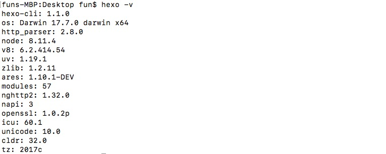

# 如何创建你的hexo博客
``` bash
也许搭建这套博客系统对小白来说有些麻烦吧，但重点它是免费的！没错你没听错，免费的！那还要啥自行车啊.  
还是乖乖充钱买腾讯云，阿里云吧。简单粗暴找一套博客系统解决所有问题，还要什么hexo+github呢。
没钱的话还是给我老老实实自己布吧。
```
## 1.环境准备
``` bash
1.系统：mac/win/linux(你开心就好，随便挑随便选)

2.软件：git，node.js

3.GitHub账号密码
```
## 2.下载git

``` bash
windows 自行官网下载。  
Linux利用命令安装。mac已经自带git，在我印象中是这样的。
```
## 3.下载node.js
``` bash
1.官网下载选择LTS 长期维护版本
2.输入node -v 有版本说明安装成功了。  
windows最好是利用git操作。
```


## 4.安装hexo
``` bash
npm install hexo-cli -g  (坐等就可以了)
```

``` bash
创建并进入你要存放hexo文件的目录再执行下面代码
hexo init  （初始化）
```
## 5.安装主题
``` bash
https://github.com/fi3ework/hexo-theme-archer   
我使用的是这位作者的主题，具体安装过程我就不冗余了。他GitHub上都写的很清楚了。
修改好自己的地址。
```

## 6.配置git
``` bash
https://www.cnblogs.com/superGG1990/p/6844952.html
推荐看这个文章，已经码不下去了，写的有点乱。因为自己当初没写笔记。遇见很多问题各种百度解决的，等我写东西我已经忘记了。
```

## 7.配置hexo
``` bash
hexo s --debug   你可以在本地http://127.0.0.1:4000 来访问你的本地博客
hexo clearn && hexo g && hexo d   把你的文件pull到GitHub上了。
访问你的站点就可以预览了。username.github.io
推荐一篇自行学习原谅我懒
https://www.cnblogs.com/visugar/p/6821777.html
```
