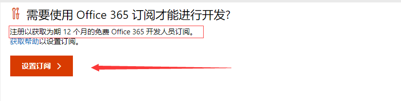
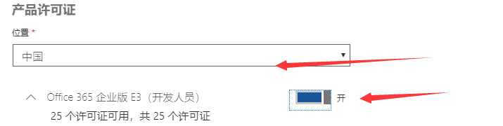
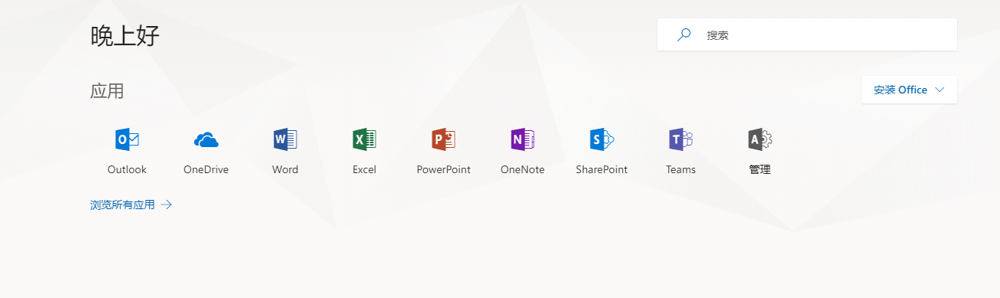
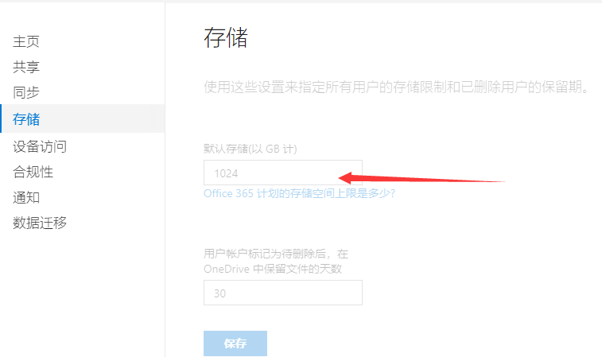

# 教你如何获得免费的Office 365账户
> 申明，这是微软 Office 365 面向开发者提供的免费订阅，是不能应用于企业、个人的商业使用的，理论上只能用于开发测试使用，请大家合理使用。

## 1.前期准备
- 微软帐号
- 可以接收短信的手机/号码
## 2.申请帐号
链接：[主页 - 开发人员计划](https://developer.microsoft.com/zh-cn/office/dev-program)
  

### 登录自己的微软帐号。

### 登录成功填写表单

  

### 记得选择订阅哦！！！
## 3.订阅设置
### 注册以获取为期 12 个月的免费 Office 365 开发人员订阅。

### 如何你们点击没有反应，说明你需要一个可以访问外网的机器。
### 提交完成你将获得这样的提示。

## 4.设置office 365
### 链接：[Office 365 登录 | Microsoft Office](https://www.office.com/)
### 注意：登录的账号不是微软帐号。应该是xxx@xxx.onmicrosoft.com   
### 这个一定需要注意，不然你是无法用个人帐号登录的。  
### 我们需要分配产品。

### 选择你登录的账户。不是微软帐号。  

### 安装箭头一步一步执行。  

  

### 记得往下划，保存在最下方。  

### 重新登录，将可以看到自己可用的账户。  
  

### 你也可以利用win10来验证。  
  
## 5.配置OneDrive
### 链接：[OneDrive](https://admin.onedrive.com)
### OneDrive默认为1024GB（1T），用此帐号可以修改为5120GB（5T）。

### 你可以理解为就是云盘，云盘当然是越大越好，这样才能存下更多东西。